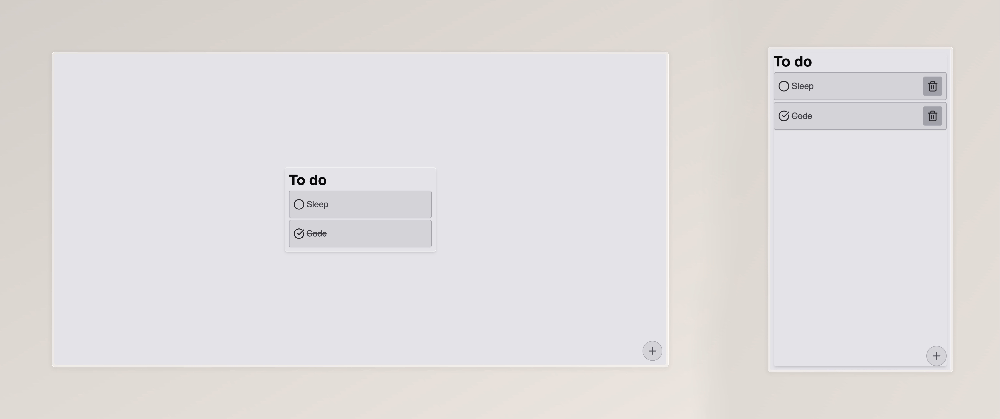

# To-Do List

A simple React application for task management with persistent data storage in
`localStorage`. This app allows users to add, mark as completed, and delete
tasks, providing an efficient way to manage daily activities.

## Features

-   **Add tasks**: Easily add new tasks to your to-do list.
-   **Mark as completed**: Toggle the completion status of tasks.
-   **Delete tasks**: Remove tasks from the list when they are no longer needed.

## Screenshots

## Technologies Used

-   **React**: For building the user interface.
-   **CSS**: For styling the application.

Made with:

## Usage

-   Click the plus button to add a new task.
-   Type the task name and press Enter to save it.
-   Click on the task to mark it as completed or click the trash icon to delete
    it.

## License

This project is licensed under the MIT License - see the LICENSE file for
details.
